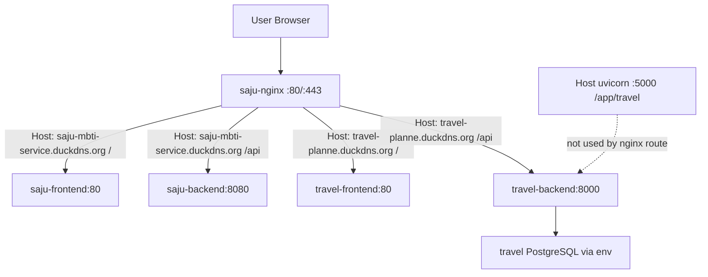

# AWS EC2 Deploy Structure Diagnostic

## 진단 범위

- 대상 EC2: `saju-mbti`
- Public IP: `3.38.61.251`
- Private IP: `172.31.34.119`
- 사주 도메인: `http://saju-mbti-service.duckdns.org/result`
- 여행 도메인: `http://travel-planne.duckdns.org/`
- 진단 방식: SSH read-only
- 금지 사항 준수:
  - 코드 수정 없음
  - 배포 실행 없음
  - nginx 수정 없음
  - docker restart 없음
  - DB 수정 없음

## 현재 실행 구조

### Docker 컨테이너

현재 실행 중인 주요 컨테이너:

| 컨테이너 | 이미지 | 상태 | 포트 |
| --- | --- | --- | --- |
| `saju-frontend` | `saju_mbti-frontend` | Up | `80/tcp` |
| `saju-backend` | `saju_mbti-backend` | Up | `8080/tcp` |
| `travel-frontend` | `travel_data_pipeline-travel-frontend` | Up | `80/tcp` |
| `travel-backend` | `travel_data_pipeline-travel-backend` | Up | `8000/tcp` |
| `saju-nginx` | `nginx:alpine` | Up | host `80`, `443` |

### Docker compose 프로젝트

확인된 compose 파일:

- `/home/ubuntu/travel_data_pipeline/docker-compose.yml`
- `/home/ubuntu/saju_mbti/docker-compose.yml`
- `/home/ubuntu/saju_mbti/docker-compose.prod.yml`

현재 `docker compose ps` 기준:

- 여행 서비스:
  - `travel-backend`
  - `travel-frontend`
- 사주 서비스:
  - `saju-backend`
  - `saju-frontend`
  - `saju-nginx`

### 추가 host uvicorn 프로세스

Docker와 별개로 host에서 아래 프로세스가 떠 있다.

| PID | 실행 경로 | 포트 | 비고 |
| --- | --- | --- | --- |
| `69677` | `/app/travel/.venv/bin/uvicorn api_server:app --host 0.0.0.0 --port 5000` | `5000` | 현재 nginx travel 도메인 라우팅에는 사용되지 않음 |
| `83053` | container 내부 `uvicorn api_server:app --host 0.0.0.0 --port 8000` | container `8000` | `travel-backend` |

주의:

- 현재 public travel 도메인은 `travel-backend:8000`으로 연결된다.
- host `:5000` 프로세스는 잔존 프로세스 또는 별도 수동 실행으로 보인다.
- 이번 진단에서는 종료하지 않았다.

## 프로젝트 경로

### 여행 서비스

- root: `/home/ubuntu/travel_data_pipeline`
- frontend: `/home/ubuntu/travel_data_pipeline/frontend`
- backend/API: `/home/ubuntu/travel_data_pipeline/api_server.py`
- compose: `/home/ubuntu/travel_data_pipeline/docker-compose.yml`
- frontend Dockerfile: `/home/ubuntu/travel_data_pipeline/frontend/Dockerfile`
- backend Dockerfile: `/home/ubuntu/travel_data_pipeline/Dockerfile`
- env: `/home/ubuntu/travel_data_pipeline/.env`

여행 Docker 구조:

- `travel-backend`
  - Python image
  - `uvicorn api_server:app --host 0.0.0.0 --port 8000`
  - `.env`를 `env_file`로 사용
  - `saju_mbti_saju-net` 네트워크에 연결
- `travel-frontend`
  - Vite build 후 nginx static serving
  - `/usr/share/nginx/html`
  - `saju_mbti_saju-net` 네트워크에 연결

### 사주 서비스

- root: `/home/ubuntu/saju_mbti`
- backend: `/home/ubuntu/saju_mbti/saju-backend`
- frontend: `/home/ubuntu/saju_mbti/saju-frontend`
- nginx config: `/home/ubuntu/saju_mbti/nginx/default.conf`
- compose: `/home/ubuntu/saju_mbti/docker-compose.yml`
- env: `/home/ubuntu/saju_mbti/.env`
- production env 후보: `/home/ubuntu/saju_mbti/.env.production`

## nginx 라우팅

현재 host의 80/443은 `saju-nginx` 컨테이너가 잡고 있다.

nginx config:

- host file: `/home/ubuntu/saju_mbti/nginx/default.conf`
- container mount: `/etc/nginx/conf.d/default.conf`

### 사주 도메인

```nginx
server {
    listen 80;
    server_name saju-mbti-service.duckdns.org;

    location /.well-known/acme-challenge/ {
        root /var/www/certbot;
    }

    location /api/ {
        proxy_pass http://saju-backend:8080;
    }

    location / {
        proxy_pass http://saju-frontend:80;
    }
}
```

### 여행 도메인

```nginx
server {
    listen 80;
    server_name travel-planne.duckdns.org;

    location /api/ {
        proxy_pass http://travel-backend:8000;
    }

    location / {
        proxy_pass http://travel-frontend:80;
    }
}
```

정리:

- 사주/여행은 `server_name`으로 분리되어 있다.
- 둘 다 같은 `saju-nginx` 컨테이너를 공유한다.
- 여행 배포 중 nginx 설정을 건드리면 사주 서비스에도 영향을 줄 수 있다.
- frontend-only 여행 배포라면 `saju-nginx` 수정/재시작 없이 `travel-frontend`만 rebuild/recreate하는 것이 안전하다.

## 도메인별 연결 상태

직접 도메인 확인:

| 도메인 | 결과 |
| --- | --- |
| `http://travel-planne.duckdns.org/` | `200 OK` |
| `http://travel-planne.duckdns.org/assets/index-5puadC8y.js` | `200 OK`, `application/javascript` |
| `http://travel-planne.duckdns.org/api/regions` | JSON 응답 정상 |
| `http://saju-mbti-service.duckdns.org/result` | `200 OK` |

nginx host header curl은 일부 명령 quoting 문제로 `400 Bad Request`가 나온 케이스가 있었으나, 실제 도메인 직접 호출은 정상이다.

## 여행 frontend/backend 상태

### Frontend

- 컨테이너: `travel-frontend`
- serving 방식: nginx static
- static root: `/usr/share/nginx/html`
- 확인 파일:
  - `/usr/share/nginx/html/index.html`
  - `/usr/share/nginx/html/assets/index-BXxtRGEj.css`
  - `/usr/share/nginx/html/assets/index-5puadC8y.js`
  - `/usr/share/nginx/html/favicon.svg`
  - `/usr/share/nginx/html/icons.svg`

현재 배포된 frontend는 container image 내부 static asset을 서빙한다.

주의:

- `/home/ubuntu/travel_data_pipeline/frontend/.env`는 없음.
- 현재 travel frontend Dockerfile은 Vite build args/env 주입 구조가 없다.
- 따라서 `VITE_SHOW_SAJU_LINK`, `VITE_SAJU_SERVICE_URL`을 production build에 반영하려면 Dockerfile/compose 또는 frontend env 파일 전략이 필요하다.
- 단, 이번 진단에서는 수정하지 않았다.

### Backend

- 컨테이너: `travel-backend`
- 내부 포트: `8000`
- nginx route: `travel-planne.duckdns.org/api/` → `http://travel-backend:8000`
- Docker network에서 `travel-backend:8000/api/regions` 응답 `200` 확인
- Host에도 별도 uvicorn `:5000`이 떠 있으나 도메인 라우팅에는 사용되지 않음

## env 주입 방식

민감정보 값은 출력하지 않고 key 존재 여부만 확인했다.

### 여행 backend env

`/home/ubuntu/travel_data_pipeline/.env` 및 `travel-backend`에서 확인된 주요 key:

- `DB_HOST`
- `DB_NAME`
- `DB_PASSWORD`
- `DB_PORT`
- `DB_USER`
- `KAKAO_REST_API_KEY`
- `NAVER_CLIENT_ID`
- `NAVER_CLIENT_SECRET`
- `OPENAI_API_KEY`
- `TOURAPI_SERVICE_KEY`

### 여행 frontend env

- `/home/ubuntu/travel_data_pipeline/frontend/.env`: 없음
- `travel-frontend` runtime env에는 Vite 관련 key 없음
- 현재 Dockerfile은 build arg로 `VITE_*`를 받지 않는다.

확인 필요한 key:

- `VITE_SHOW_SAJU_LINK`: 현재 EC2 travel frontend env에서 확인되지 않음
- `VITE_SAJU_SERVICE_URL`: 현재 EC2 travel frontend env에서 확인되지 않음

### 사주 env

`/home/ubuntu/saju_mbti/.env` 주요 key:

- `CLAUDE_API_KEY`
- `CLAUDE_MODEL_HAIKU`
- `CLAUDE_MODEL_SONNET`
- `CORS_ALLOWED_ORIGINS`
- `DB_HOST`
- `DB_NAME`
- `DB_PASSWORD`
- `DB_PORT`
- `DB_USER`
- `JPA_DDL_AUTO`
- `VITE_API_BASE_URL`

## 사주 서비스 영향 위험

위험 포인트:

1. `saju-nginx`가 사주/여행 도메인을 모두 라우팅한다.
2. `/home/ubuntu/saju_mbti/nginx/default.conf`가 두 도메인 설정을 동시에 포함한다.
3. nginx 컨테이너를 잘못 재시작하거나 설정을 잘못 바꾸면 사주/여행 둘 다 영향받는다.
4. 여행 compose는 외부 network `saju_mbti_saju-net`에 의존한다.
5. 여행 frontend만 배포할 때도 `travel-frontend` 컨테이너가 `saju-nginx`와 같은 network에 유지되어야 한다.

낮은 위험 포인트:

- 여행 frontend/backend 컨테이너 자체는 사주 backend/frontend와 분리되어 있다.
- 여행 frontend-only 배포는 nginx 설정을 바꾸지 않고 `travel-frontend`만 갱신하면 사주 영향이 작다.

## 배포 시 건드리면 안 되는 파일

여행 frontend-only 배포 기준으로 건드리면 안 되는 항목:

- `/home/ubuntu/saju_mbti/nginx/default.conf`
- `saju-nginx` container
- `saju-backend`
- `saju-frontend`
- `/home/ubuntu/saju_mbti/.env`
- `/home/ubuntu/saju_mbti/.env.production`
- 여행 backend 관련:
  - `/home/ubuntu/travel_data_pipeline/api_server.py`
  - `/home/ubuntu/travel_data_pipeline/course_builder.py`
  - `/home/ubuntu/travel_data_pipeline/tourism_belt.py`
  - `/home/ubuntu/travel_data_pipeline/migration_*.sql`
  - 운영 DB

주의할 항목:

- `/home/ubuntu/travel_data_pipeline/docker-compose.yml`
  - frontend-only 배포 시 `travel-frontend`만 대상으로 삼아야 한다.
- `/home/ubuntu/travel_data_pipeline/.env`
  - backend secrets 포함. 값 출력/commit 금지.
- host uvicorn `:5000`
  - 현재 도메인 라우팅에는 사용되지 않지만, 임의 종료 금지. 별도 정리 작업으로 판단 필요.

## 안전한 다음 배포 절차 제안

현재 구조에서 여행 frontend-only 배포를 안전하게 하려면:

1. 로컬에서 `npm run lint`, `npm run build` PASS 확인
2. `VITE_SHOW_SAJU_LINK`, `VITE_SAJU_SERVICE_URL`을 EC2 Docker build에 반영할 방식 결정
   - 현재 travel frontend Dockerfile은 Vite build args를 받지 않음
   - 가장 안전한 방식은 별도 PR/커밋으로 Dockerfile/compose에 frontend build args를 명시하는 것
3. EC2에서 `/home/ubuntu/travel_data_pipeline`만 대상으로 git pull
4. 사주 폴더와 nginx는 건드리지 않음
5. 여행 frontend만 build/recreate
   - 예: `docker compose up -d --build travel-frontend`
6. `travel-frontend`가 `saju_mbti_saju-net`에 붙어 있는지 확인
7. 도메인 smoke:
   - `http://travel-planne.duckdns.org/`
   - `http://travel-planne.duckdns.org/api/regions`
8. 사주 smoke:
   - `http://saju-mbti-service.duckdns.org/result`
9. 모바일 실기기 smoke
10. 문제 발생 시 `travel-frontend`만 이전 image/build로 rollback

## 현재 구조 요약



## 주요 결론

- EC2는 사주와 여행이 같은 nginx 컨테이너를 공유하는 구조다.
- 여행 서비스는 Docker compose 기반으로 `travel-frontend`, `travel-backend`가 실행 중이다.
- 여행 도메인은 `travel-backend:8000`을 사용하며, host `:5000` uvicorn은 현재 도메인 라우팅에 사용되지 않는다.
- 여행 frontend는 nginx static container이며, 현재 EC2 frontend build에는 `VITE_SHOW_SAJU_LINK`, `VITE_SAJU_SERVICE_URL` 주입 구조가 확인되지 않는다.
- 사주 서비스에 영향 없이 배포하려면 nginx/saju 컨테이너는 건드리지 말고 `travel-frontend`만 대상으로 해야 한다.
